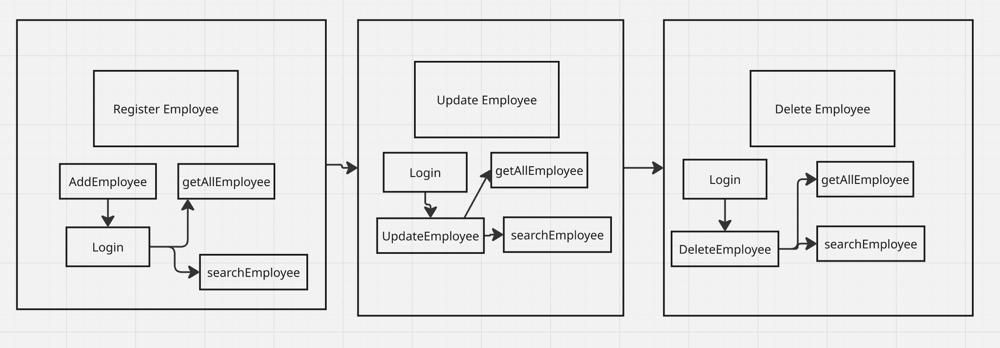
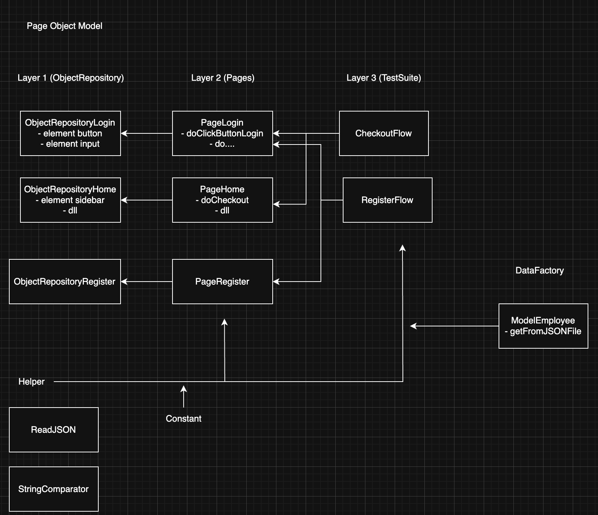
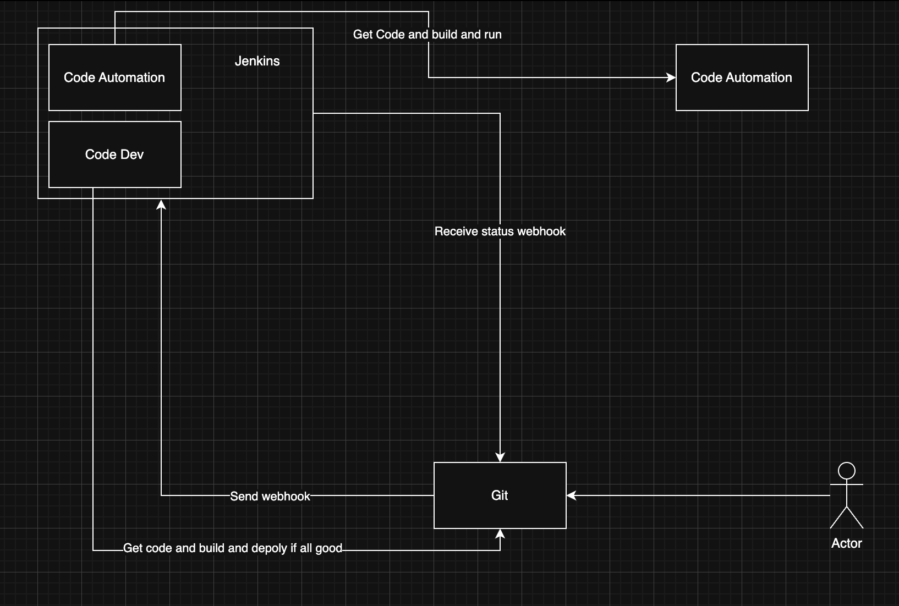

# Automation Project (TestNG | API Automation | Web Automation)

## Learning Path

### Day 1 - QnA

### Day 2 - TestNG

#### Anotation TestNG Lifecycle
```
@BeforeSuite
    @BeforeTest
        @BeforeClass
            @BeforeGroups
                @BeforeMethod
                    @Test
                @AfterMethod
            @AfterGroups
        @AfterClass
    @AfterTest
@AfterSuite
```

#### Data Provider
```src/test/java/testng/DataProviderTest.java```

#### Test Suite
```src/test/resources/testng_simple_suite.xml```
```src/test/resources/testng_simple_suite.xml```

#### Assertion
```src/test/java/testng/AssertTest.java```

#### IRetryAnalyzer
```src/test/java/testng/RetryTest.java```

reference: https://testng.org/

### Day 3 - RestAssured

#### Change POM configuration - run test suite more flexible
```<suiteXmlFile>${suiteXml}</suiteXmlFile>```
```mvn test -DsuiteXml=TEST_SUITE_PATH```

#### Basic rest assured
```src/test/java/restassured/EmployeeTest.java```

#### E2E rest assured
```src/test/java/restassured/NewEmployeeTest.java```

### Day 4 - E2E


### Iterator

Array
- Array x / List
    - x[4]

iterator x = 1,2,3,4
x.next() | 1
iterator x | 2,3,4
x.next() | 2

### PageFactory



### Day 13
- Hooks
- Properties
- Pengenalan CI / CD
